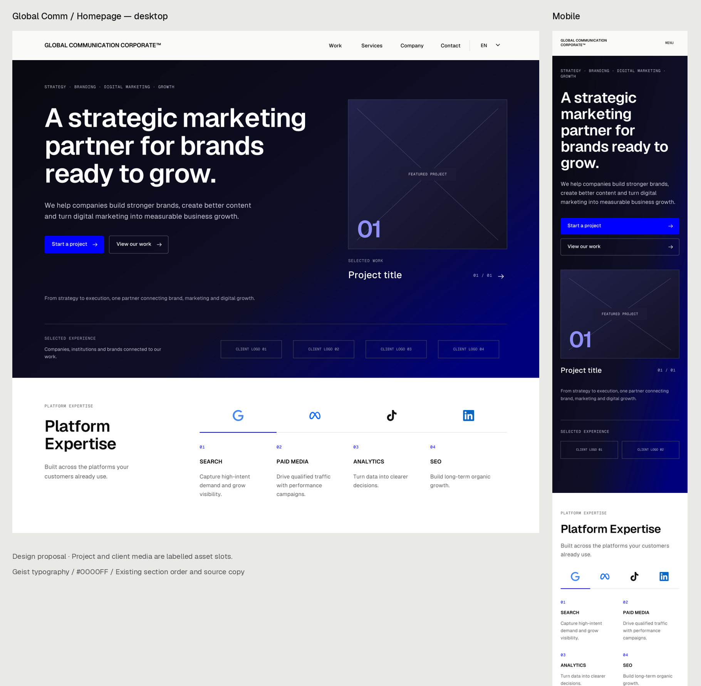

# Global Comm homepage design proposal

Committed to `design/homepage-system-v1` as a visual handoff. This proposal was created from the source revision cited below; it does not claim the older design branch already implements that revision.

Desktop: 1440 × 8941. Mobile: 390 × 12081.

## Open in Figma

Drag Global-Comm-Desktop.svg and Global-Comm-Mobile.svg onto a Figma Design canvas. These versions use outlined typography to preserve the rendered appearance without requiring font installation. Text is vector artwork, not editable Figma text.

Alternative live-text SVGs retain SVG text elements. Install the supplied fonts before opening them in a compatible vector editor. Their text-editing behavior after Figma import has not been verified.

The PNGs show each entire page. Global-Comm-Preview.png is a cropped overview of the top sections.

## Basis and design choices

Repository: https://github.com/Global-C-Corp/Global-Comm-Corporate
Branch inspected: claude/headless-cms-project-h7k170
Commit: 3f5dea4e697ab9389e55f52dc5e27d5d1aacd637
Route: /design/home

The proposal uses the active branch's CLAUDE.md direction to retain the current section sequence and source copy while redesigning presentation. The three supplied documents inform the editorial grid, restrained blue accents, clear CTA hierarchy, sharp media shapes and responsive layouts. Where their generic page pattern differs from the active route, the active route is retained; no new method section has been inserted.

Section order: Header → Hero → Platform expertise → Point of view → Four expertise families → Selected work → Client logos → Evidence and FAQ → Final CTA → Footer.

Brand blue: #0000FF. Main typography: Geist and Geist Mono. The existing French expertise content retains Inter and Lora. Its French wording is intentionally preserved within the source's otherwise English page.

Project and client imagery was absent from the inspected deployment. Labelled slots show the intended populated composition; they do not represent approved projects, clients, or evidence. Replace these with authorized CMS content. Preserve the existing CMS rules that hide selected-work and client sections when their data is empty. Do not publish the placeholder labels.

## Handoff and limitations

These are static visual proposals. Figma's Starter-plan MCP tool-call limit blocked native canvas editing. No complete native Figma design, auto-layout system, component library or interactive prototype was created. SVG import has not been tested in Figma.

The Google tab and first FAQ answer are shown as selected/open states. Reuse existing tab, accordion, navigation, carousel and link behavior in implementation. All tab/FAQ content is included in source/content.json. Add native component states and keyboard/focus behavior during implementation; static SVGs do not implement them.

Other language layouts and intermediate viewport widths are not separately rendered. This commit archives the design proposal only. Application source and deployments were not modified by this design package.

Validation performed: SVG XML parsing, unique ID checks, horizontal text-bounds scan, and visual inspection of rendered desktop and mobile sections. No horizontal text overflow was detected. This is not browser or accessibility certification.

## Package contents

- Two outlined SVG artboards and two live-text alternatives.
- Full-page desktop/mobile PNGs and a comparison preview.
- Fonts and their license files.
- Source copy, vector icon assets, layout metadata, and the Python design generator.

The generator uses fontTools, Pillow and PyMuPDF, with Inkscape for final SVG rendering. Font sources: vercel/geist-font and google/fonts. Platform icons: simple-icons (LinkedIn from v11). Trademark rights remain with their respective owners.
